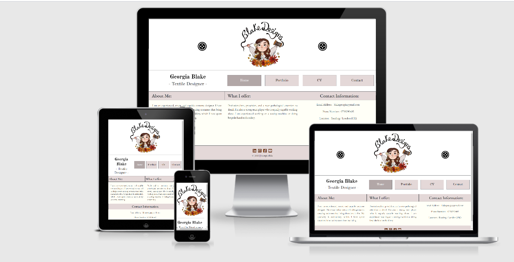

# Georgia Blake (Textile Designer) Portfolio/CV Website



[Live Here](https://dudeguythethird.github.io/milestone_project1/index.html)

This site is a portfolio/CV site for a textile designer called Georgia Blake. Its primary function is to introduce Georgia to potential recruiters or other textile designers, to give them an accurate idea of her style and competencies, without confusing or frustrating them. The project is designed to be useful both to recruiters and other members of the textile community. This means that it has to function well as a showcase of Georgia's work while containing smooth and frictionless pathways to getting in contact with Georgia herself (for either collaborators or recruiters.) Given the variety of potential users, it is of paramount importance that the user experience be consistently good across all commonly used devices.

As the project is for an artist, it would be beneficial for it to reflect something of that artist's personality. This is why the project has a minimalist look that incorporates color and font choices inspired by Georgia's logo. Indeed, the design and feel of the site is intended to flow from the design and feel of the logo. It is also deliberately sparse. After all, this is a portfolio site, it is intended to be (among other things) a vessel for the work of the artist. One wouldn't want the design of the site to distract from that work, hence a minimal and stylistically consistent approach has been applied throughout.


## UX

As mentioned in the introduction, there are two main categories of target user for this project: recruiters and other textile designers. While their needs are similar they are not the same. To give you some idea of how their needs may differ and why my project is the best way for them to fulfill their needs, I will outline four user stories below. Two, for two separate types of recruiter, two for two separate types of textile designer.


### Recruiter 1 (Looking for a costume designer for a film, doesn't know anything about Georgia Blake yet)

This recruiter (let's call her Rebbecca) is searching for a costume designer for an upcoming major film, being shot near London. She needs someone good, whose body of work indicates a compatibility with the project, and she needs them fast. Somehow, she's come to Georgia's portfolio page, perhaps through a colleague, on Linkedin, or perhaps Georgia has emailed it to her directly. The things she needs to see are: 1. examples of Georgia's work, 2. Georgia's work history, and 3. Her contact information, provided Rebbecca is happy with what she sees in 1 and 2.

When she lands on the homepage she will immediately see the eye-catching logo with 'Blake designs' and know she's in the right place. Beneath that she will see the nav bar, which has 'home, portfolio, CV, and contact'  written clearly and boldly in several large buttons. She may, at this point, immediately navigate straight to portfolio and inspect her work. Then she may continue on to CV and inspect that also, this will be easy as the nav bar remains the same across the site's pages, whatever the device Rebbecca is using. If she needs to download a copy of the CV, this will be easy for her to do, as a large eye catching button is there on the 'cv' page for her to do it with. It is near the top of the page, meaning if she already knows that she needs a document version of the CV, she can just download it straight away without having to search.  If she wants to get in contact with Georgia, she easily can, by either using the information in the downloaded CV, by clicking the contact button in the nav bar, or by using the information she may have already read on the homepage.


### Recruiter 2 (Already familiar with Georgia just wants to contact her)

Maybe this recruiter is Rebbecca but later on, after having thought about Georgia's CV. She's decided to contact Georgia now, so just needs the information to do it. So she google's Georgia's name, navigates to her portfolio site and quickly finds the information she needs as it is right there on the homepage. If somehow she doesn't scroll to it (maybe on mobile where it is at the bottom of the page) then she is likely to see the contact link in the nav bar, which will allow her to complete her goal nonetheless.


### Textile Designer 1 (Doesn't know Georgia, has found her site on a costume designer forum.)

This type of user (let's call them Greg) isn't interested in hiring Georgia and so will have little interest in her work history. Greg just wants to see what Georgia is about, so will probably spend more time on the homepage, then might quickly navigate to the portfolio to look at her work. Should he see something of interest that inspires him to contact her about a potential collaboration, then he can easily do so from the 'Contact' page found in the nav bar.


### Textile Designer 2 (Knows Georgia, wants to get in contact)

Maybe this designer is Greg but later on. He's decided to contact Georgia now, so just needs the information to do it. So he google's Georgia's name, navigates to her portfolio site and quickly finds the information she needs as it is right there on the homepage. If somehow he doesn't scroll to it (maybe on mobile where it is at the bottom of the page) then he is likely to see the contact link in the nav bar, which will allow him to complete his goal. The contact form on there is designed for potential collaborators to explain their project idea. 

[Here](https://github.com/dudeguythethird/milestone_project1/tree/master/assets/wireframes) are some early wireframe mockups of this project. They are not entirely accurate to the final project, even in terms of layout, but they are a good indication of my initial design ideas.


## Features


1. Homepage: 
    1. Nav bar with a large logo image displayed above it. (The logo is unique to this page, it is displayed on others but smaller, near the name “Georgia Blake”.) This logo is flanked by two button icons arranged in a bootstrap grid. They disappear on phones, as these devices have narrower screens and the logo is the important point. It is also a link back to the homepage, as are the words “Georgia Blake -textile designer-”. 
    2. The nav bar consists of four customised bootstrap buttons, that link to the three other pages of the site. They are horizontally ordered on desktops and most tablets. 
    3. On mobile, the navbar collapses down into a burger icon dropdown menu. The buttons are ordered vertically and take up nearly the whole width of the mobile’s screen. This was achieved with standard bootstrap functionality, customised.
    4. The main content of the homepage is beneath the nav bar and is arranged in three columns on desktop, two above one on tablet, and vertically stacked on mobile. These contain an ‘About Me’ section, a ‘What I bring to your team’ section, and a ‘Contact information’ section. 
    5. Beneath is the footer, with reactive icon links to social media pages (dummy links currently) and generic copyright text. It does not change significantly over different screen sizes and remains the same over all 4 pages.
2. Portfolio:
    6. The nav bar is slightly different to the homepage but the general layout and look remains the same. The large logo is no longer above it and a smaller version of it now sits to the left of the title, both are functional links back to the home page. To the right of this (on desktop) is the nav bar, which is only different in that “portfolio” is now highlighted, not “home”. This pattern will remain the same over the other pages. The nav bar still collapses into a drop down on mobile. 
    7. The main content of the page is a series of images in a gallery with different sections. They are arranged in a masonry style with 3 columns on desktop, 2 on tablet, and 1 on mobile. Each image has been given a polaroid esque border with a shadow, to create the illusion of presence. The number of images shown in each section reduces as screen size becomes thinner, to avoid having to scroll too much.
3. CV:
    8. The main content of this page is arranged in three columns on desktop, two on tablet, and one vertical stack on mobile.
    9. It consists of a skills list with a cv download link button beneath it in the leftmost column and a work history list in the middle and right columns. (on desktop)
    10. The cv download button is a custom bootstrap button that has been designed to look and act like the social media links in the footer.
    11. On mobile, the number of items in the work history section is reduced, to avoid too much scrolling. 
4. Contact:
    12. Contains a form that can be filled out for a potential collaborator to send an email to Georgia explaining their project idea. Contact details are also repeated here.
    13. Form consists of a text field for the name, an email field, a text area for leaving a description of the project, and a send button. The form is a dummy form as this project has no back end. 


### Existing Features


*   Features 1a, b, and c - (****The Nav Bar****) - Allows all types of user, on all types of device, to navigate to their needed destination. Also provides a tone for the website with the logo and its overall aesthetic.
*   Feature 1d - (****Homepage Main Content****) - Allows any type of user that is interested (primarily recruiters and collaborators who do not yet know Georgia) to get an initial feel for Georgia as a creative. The ‘What I bring to your team’ is intended more for recruiters and provides them with a quick summary of Georgia’s core competencies. The contact information section is primarily for returning users of both types, who want to get in contact with Georgia.
*   Feature 1e - (****The Footer****) - Provides all interested users with links to Georgia’s social media accounts, this could conceivably be either recruiters or collaborators. It also contains basic copyright information. 
*   Feature 2a - (****The Nav Bar on pages that are not ‘Home’**)** - This altered version of the nav bar has a smaller version of the logo image. It is smaller because the user has already had their initial introduction to Georgia and the site, so this no longer needs to be a main focus on non-home pages. The correct button is also highlighted in the nav bar so users know where they are at all times.
*   Feature 2b - (****Portfolio main content**) **- Allows recruiters and collaborators who are new to Georgia to get a sense of her work. It is split into three thematically arranged sections: embroidery, costumes, and head-pieces. The total number of images shown reduces on tablets and even more so on mobile, to avoid too much scrolling. This is admittedly a trade-off that makes in the useability of the site but diminishes its informativeness on tablets and mobiles. 
*   Feature 3a, b, c, and d (****CV main content**)** - Allows recruiters who are new to Georgia’s work get a sense of her work history and if necessary, download a local copy of her CV. The link for this is deliberately positioned near the top of the page on all kinds of devices to allow recruiters who know they will need it to get it quickly and without unnecessary scrolling. 
*   Feature 4a and b (****Contact main content****) - Allows collaborators to send Georgia an email explaining their project ideas. Also contains her contact information again, for any recruiters that may have been somewhere else on the site, decided they wanted to get in contact, and clicked on ‘contact’ in the nav bar to do so. It is likely that most recruiters would like her information as opposed to using the form. This is more in line with their needs. 


### Features Left to Implement

* Uniform sizing for portfolio images.
* Sticky header.
* Tab-based portfolio.


## Technologies Used


*   [HTML5]
    *   This project uses **HTML5** to provide structure and content to the site.
*   [CSS3] 
    *   This project uses **CSS3** to provide styling, layout and basic interactivity to the structure and content defined by HTML5.
*   [JavaScript]
    *   This project uses **JavaScript** to provide it with basic interactivity, by way of the Bootstrap framework below.
*   [Bootstrap](https://getbootstrap.com/)
    *   This project uses the **Bootstrap** framework to simplify creating dropdowns, buttons, a grid layout, and other CSS/JavaSript functionality. 
*   [Google Fonts](https://fonts.google.com/)
    *   This project uses **Google Fonts** to allow the adding of more interesting fonts to the project.
*   [Font Awesome](https://fontawesome.com/)
    *   This project uses **Font Awesome** to allow the inclusion of icons. 


## Bugs


### Solved:


1. Links inside buttons in navbar do not cover the whole button area: 

    1. This bug was a self inflicted error. Essentially I coded the buttons for the nav bar in a fairly roundabout way. I put standard Bootstrap buttons in place, then put the relevant links inside the buttons and customized the buttons. The problem was that the link only worked when it was clicked (ie. when the user mouses over the text in the button, not the whole button area.)
    2. I initially solved this problem by targeting all links that were children of buttons with a CSS rule set, that I found [online](https://stackoverflow.com/questions/11078509/how-to-increase-the-clickable-area-of-a-a-tag-button*/). Essentially, it makes the &lt;a> as large as it’s containing button:


```
button a {
 display: inline-block;
 width: 100%;
 height: 100%;
}

```

However, I eventually decided this workaround was too cumbersome. So I just gave the links that used to be in buttons all the same classes as the old buttons, for example:


```
<a href="contact.html" class="btn btn-secondary center btn-nav-bar-non-main btn-nav-link active">Contact</a>
```


		
The functionality is much more consistent now. 


2. Buttons not behaving as desired: 

    1. Bootstrap has certain default styles in place for buttons that were not at all in line with my style ideas. 
    2. To rectify this, I used Chrome developer tools to find the offending styles and added them to my CSS file, then customised them to my liking, for example: 


```
.btn-secondary:not(:disabled):not(.disabled).active,
.btn-secondary:not(:disabled):not(.disabled):active,
.show > .btn-secondary.dropdown-toggle {
 background-color: #b2a7a7;
}
```


I do not claim to understand all of this code, but it is now doing what I want it to be doing.


3. CV page not formatting properly on some tablets: \

    1. My CV page has a left column that contains work history, it is separated from the right side of the page by a solid border of 1px. Initially, this border did not reach the footer on some taller screen sizes, this looked quite bad. 
    7. After using chrome dev tools, I determined that the reason it wasn’t stretching all the way to the bottom of the main content section was because it was inheriting the height of it’s direct parent, which at the time was a &lt;div class= “row”>, so I transferred all the classes that were styling that row to the main content &lt;section> and removed the row, solving the problem:


```
<section class="main-content main-content-2 site-content row no-gutters">

.skills {
 text-align: center;
 height: inherit;
}

```


4. Footer not sticking to bottom of page: 

    1. On some taller screens, my footer was not on the bottom of the page, because there was not enough page content to push it down there. 
    2. To rectify this, I used some CSS classes that I found [online](https://philipwalton.github.io/solved-by-flexbox/demos/sticky-footer/) that used flex box to implement this functionality: 


```
<body class="site">

<section class="site-content portfolio">

.site {
 display: flex;
 min-height: 100vh;
 flex-direction: column;
}

.site-content {
 flex: 1;
}
```

## Testing

See external [document](https://github.com/dudeguythethird/milestone_project1/blob/master/TESTING.md) for testing.

## Deployment

This project is deployed on GitHub pages. I deployed it by:


1. Going to the settings menu of my GitHub project. 
2. Scrolling down to the GitHub Pages section.
3. Selecting the master branch source and the appropriate folder (root).
4. Pressing save, waiting for the page to reload.
5. Waiting a few minutes for pages to get set up, afterwards a link was provided: [https://dudeguythethird.github.io/milestone_project1/](https://dudeguythethird.github.io/milestone_project1/)
6. I can push any further pages to the project from Git Pod (my development environment) by using the ‘git add’, ‘git commit’, and ‘git push’ commands in the CLI. 

More info on GitHub pages: https://pages.github.com/

Ultimately, there will be no differences between the deployed and development versions.


## How to run this project locally


1. Create a [GitHub](https://github.com/) account.
2. Using Chrome, install the gitpod[ browser extension](https://chrome.google.com/webstore/detail/gitpod-dev-environments-i/dodmmooeoklaejobgleioelladacbeki).
3. Restart the browser after installation.
4. Log in to GitPod with your GitHub account.
5. Go to the project [repository](https://github.com/dudeguythethird/milestone_project1) on GitHub.
6. Click the green git pod button, this will trigger a new workspace to be created in GitPod with the project in it. 


## Cloning this project

Want to make some changes to this project and develop on your own version?


1. Got to this GitHub [repository](https://github.com/dudeguythethird/milestone_project1).
2. Under the name, click the ‘code’ drop down, then clone or download.
3. Copy the URL in the HTTPS section.
4. Go to your local IDE and open the terminal.
5. Navigate to the folder you would like to clone the code in.
6. Type “git clone ” then paste the URL you copied in step 3. 
7. Press enter!


## Credits


*   Method for vertically centering content: [https://www.w3schools.com/howto/howto_css_center-vertical.asp](https://www.w3schools.com/howto/howto_css_center-vertical.asp) 

*   Footer sticky to bottom of page:

    https://css-tricks.com/couple-takes-sticky-footer/


    [https://philipwalton.github.io/solved-by-flexbox/demos/sticky-footer/](https://philipwalton.github.io/solved-by-flexbox/demos/sticky-footer/) 


*   Method for centering horizontally: [https://www.w3schools.com/howto/howto_css_image_center.asp](https://www.w3schools.com/howto/howto_css_image_center.asp) 

*   Standard column layouts from bootstraps documentation (I used a three equal width column layout at the start of index.html and various other grid layouts throughout):[https://getbootstrap.com/docs/4.5/layout/grid/#auto-layout-columns](https://getbootstrap.com/docs/4.5/layout/grid/#auto-layout-columns) 

*   A heavily customised bootstrap standard dropdown was used for the collapsable mobile navbar: [https://getbootstrap.com/docs/4.5/components/dropdowns/](https://getbootstrap.com/docs/4.5/components/dropdowns/) 

*   This method was used in an earlier version of the project for expanding the clickable area of a link (no longer in the project): [https://stackoverflow.com/questions/11078509/how-to-increase-the-clickable-area-of-a-a-tag-button*/](https://stackoverflow.com/questions/11078509/how-to-increase-the-clickable-area-of-a-a-tag-button*/) 

*   This method makes certain content invisible on certain screen sizes and came straight from bootstrap’s documentation: [https://getbootstrap.com/docs/4.5/utilities/display/](https://getbootstrap.com/docs/4.5/utilities/display/) 

*   Bootstrap button classes used on cv and contact pages: [https://getbootstrap.com/docs/4.5/components/buttons/](https://getbootstrap.com/docs/4.5/components/buttons/) 

*   Custom .hidden class was influenced by: [https://www.sitepoint.com/hide-elements-in-css/](https://www.sitepoint.com/hide-elements-in-css/)


### Content 


- All text content is original.


### Media 


- The photos used in the portfolio of this site were obtained from the real life Georgia Blake, they are real examples of her real work.  


- Button icon image sourced from cleanpng.com: https://www.cleanpng.com/png-clothes-button-png-27937/preview.html


### Acknowledgements

- I received inspiration for this project from the Rosie portfolio project in the Code Institute course, as well as the Love Running and Whisky Drop projects. 