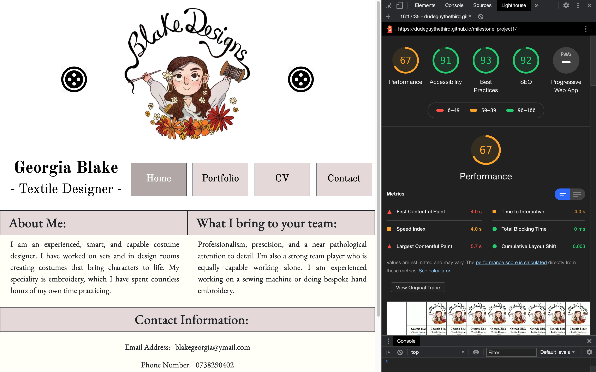
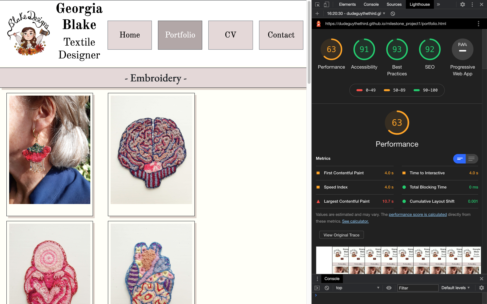
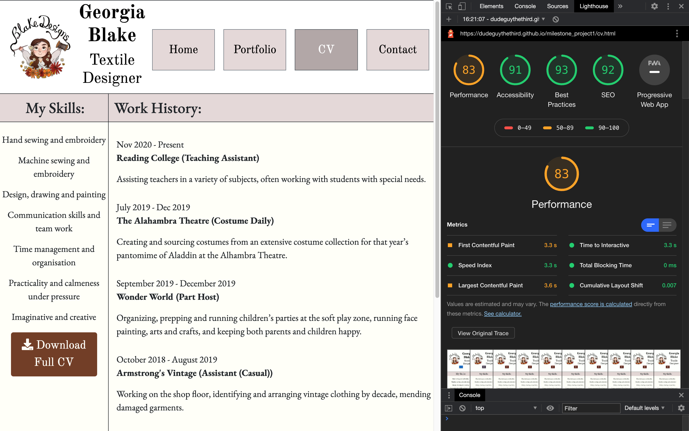
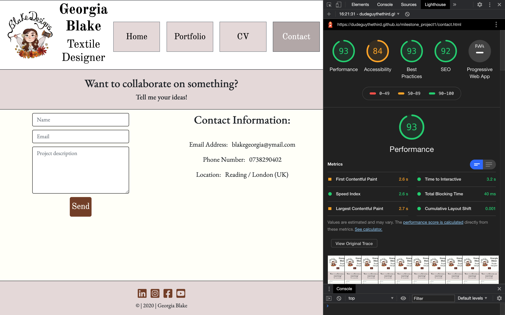

# Testing

All [HTML](https://validator.w3.org/) and [CSS](https://jigsaw.w3.org/css-validator/) has been run through their respective validators, and have returned without errors. According to the validator, my CSS is fine but some of the CSS in the various CDNs that I have used does flag issues.

Now, I’m going to revisit the user stories from the above UX section of the README file and explain how to test the relevant functionality:

#### User 1 (New Recruiter)

1. Inspect homepage.
2. Go to the Portfolio page and inspect it.
3. Go to the CV page and inspect it.
4. Try downloading the full CV. Check it opens in another tab. 
5. Go to the Contact page and inspect it.

1.
2.
3.
4.
5.

#### User 2 (Familiar Recruiter)

1. Inspect homepage.
    1. Optionally, go to the Contact page and inspect that. 

1.
1a. 

#### User 3 (New Collaborator)

1. Inspect homepage.
2. Go to the Portfolio page and inspect it.
3. Go to Contact page 
4. Try to submit a blank form and verify that an appropriate error message is displayed.
5. Try to submit the form with an incorrectly filled out email address. Verify that an appropriate error message is displayed.
6. Try to correctly fill out the form and verify that the page refreshes (no implemented back end).

Images for steps one and two are found above in new recruiter section.

4.
5.
6.

#### User 4 (Familiar Collaborator)

1. Inspect homepage
2. Go to Contact page 
3. Try to submit a blank form and verify that an appropriate error message is displayed.
4. Try to submit the form with an incorrectly filled out email address. Verify that an appropriate error message is displayed.
5. Try to correctly fill out the form and verify that the page refreshes (no implemented back end).

Demontrative image above.

#### User X (Any of the above but on mobile)

1. Repeat any of the above tests on mobile, to test the dropdown nav bar.
2. Ensure that the custom mobile layouts do not interfere with their steps.

#### User Y (Any of the above but on tablet)

1. Repeat any of the above tests on a tablet, to test that the custom tablet layouts do not interfere with their steps.

Other features you may wish to test include the social media links in the footer, to ensure they open in another browser tab. They could conceivably be a part of any of the above stories (The social media links do not currently lead to specific accounts, only to the relevant site’s homepage, images below.)

I have performed all of the above tests myself and found the project to have passed them. All the relevant functionality is shown in the browser testing videos below.

### Layout Testing

Ensuring responsive design across the site was a priority for this project. It was built with a bootstrap grid layout, which made this a lot easier to achieve. In general, pages on my site have max. three columns (main content) on desktop, max. two on tablet, and max. one on mobile. This is easily verifiable with use of Chrome’s developer tools, that allow you to simulate many popular device screen sizes.

The video below shows me performing such tests. Initially, the site does not format properly for the Ipad view. It eventually does after switching back and forth. I think this is a bug with the tools, not my project, though I may be wrong. Video [here](https://drive.google.com/file/d/1o_SGNEhkik2xB9ml4PX64WMNdMZGpZm6/view?usp=sharing).

### Browser Testing

I have recorded videos of myself testing the project across the major browsers [here](https://drive.google.com/drive/folders/1sPbTz5k_ZzB2YQZ7lZIsBydtVCgzn0vK?usp=sharing). 

### Chrome lighthouse reports for the 4 pages:

